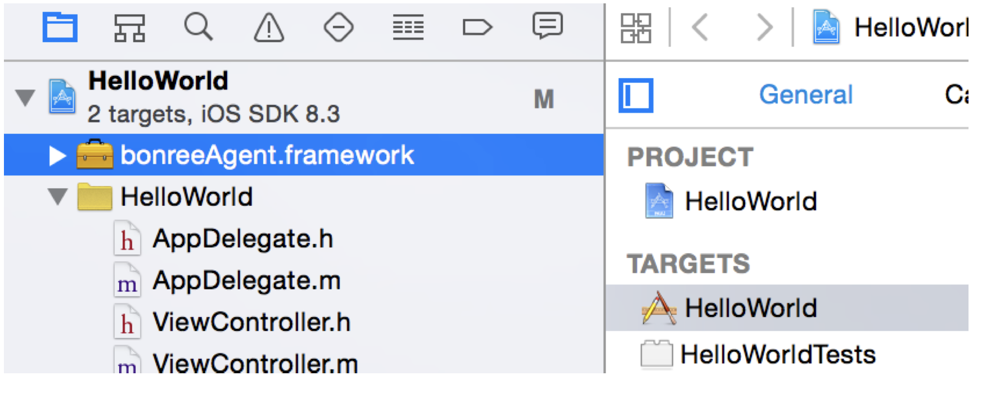
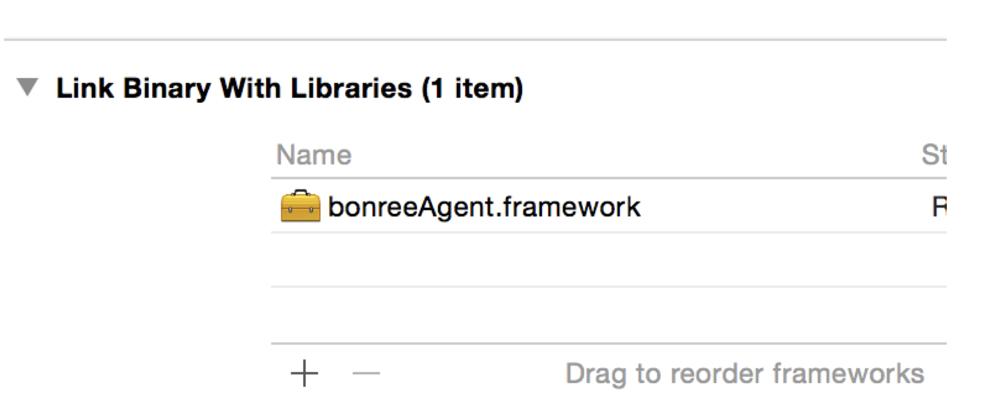
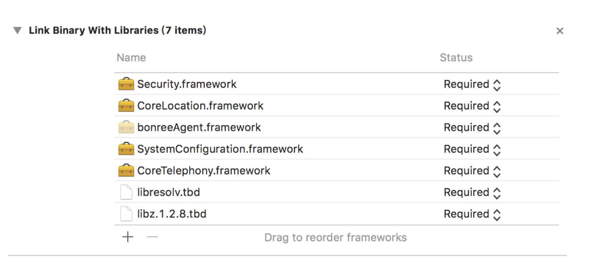
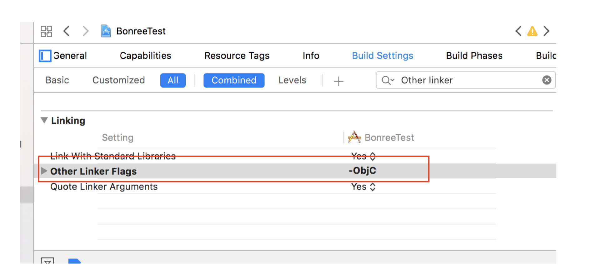
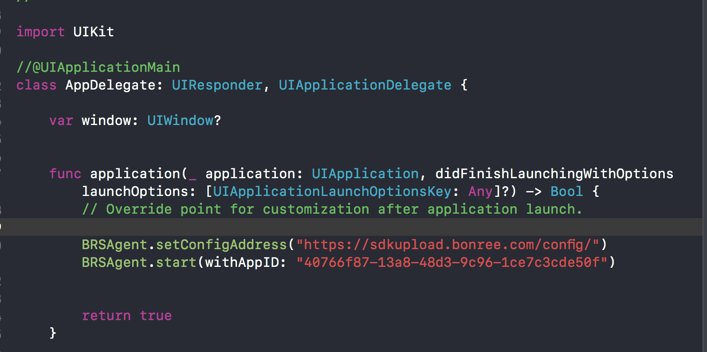

# <center>bonreeAgent</center>

#####  <center>博睿性能采集SDK</center>

---


### 安装指南

##### Cocoapods方式

* 在工程**Podfile**文件中添加

  ```objective-c
  pod 'bonreeAgent'
  ```

##### 安装包方式

* 解压**bonreeAgent.framework.tar.gz**，将**bonreeAgent.framework**加入到项目中，如图所示:



* 在**BuildPhass** -> **Link Binary With Libraries**中添加**bonreeAgent.framework**，如图所示：



* 添加以下依赖库:
  * libresolv.tbd（**必须引入**）
  * libc++.tbd（**必须引入**）
  * webKit.framework（如果项目支持iOS8之前版本需要添加）



* 在**Build Setting**中搜索**Other Linker Flags**, 添加编译标志**-ObjC**。如图所示:



---

### 使用

##### Objective-C

* 引入头文件: 在AppDelegate.m中导入头文件。

* 在application:didFinishLaunchingWithOptions中设置config地址与AppId，如图所示:

```objective-c
[BRSAgent setConfigAddress:@"https://sdkupload.bonree.com/config"];
[BRSAgent startWithAppID:@"40766f87-13a8-48d3-9c96-1ce7c3cde50f"];
```


##### Swift

* 在对应的桥接⽂件⾥bridging-header.h⾥导⼊头⽂件，如图所示:


* AppDelegate.swift文件中设置config地址和AppId，如图所示:



运行后有日志 bonreeAgent config succeeded ,即表示嵌码成功,如下:

```objective-c
2019-06-21 13:55:40 +0000 [bonreeAgent] bonreeAgent config succeeded
```

---

### JS行为数据监测

* 会员id设置

  * 字段说明

    * id：客户app会员用户的id，主要用于区分不同会员用户的行为。

  * 示例

    在需要设置会员用户id时，添加如下代码

    ```html
    <script>
        function myclick() {
            document.getElementById("demo").innerHTML=Date();
            bonreeJsBridge.onMemberId('1');
        }
    </script>
    ```

* 自定义视图的统计

  ```javascript
  bonreeJsBridge.onPageStart(String pageId, String pageName);
  bonreeJsBridge.onPageEnd(String pageId, String pageName);
  ```

  * 字段说明

    * pageId：自定义视图的ID（建议使用字母）
    * pageName：自定义视图的名称（建议使用字母）

  * 示例

    监测关于html界面，其对应html名称为About.html

    ```html
    <script>
        function myclick() {
            document.getElementById("demo").innerHTML=Date();
            bonreeJsBridge.onPageStart("1","About");
            bonreeJsBridge.onPageEnd("1","About");
        }
    </script> 
    ```

  * **注意点：** onPageStart和onPageEnd须成对调用

* 自定义事件的统计

  ```javascript
  bonreeJsBridge.onEvent(String eventId, String eventName);
  ```

  * 字段说明

    * eventId：自定义事件的ID
    * eventName：自定义事件的名称

  * 示例

    某html页面将监测某button的使用情况

    ```html
    <script>
        function myclick() {
            document.getElementById("demo").innerHTML=Date();
            bonreeJsBridge.onEvent("1",'just a test');
        }
    </script>
    ```

* 用户自定义信息的统计

  ```javascript
  bonreeJsBridge.setUserInfo(String kv);
  ```

  * 字段说明

    * kv：自定义信息，NSDictionary或者json 字符串

  * 示例

    某html页面在进入某一个页面时设置自定义信息

    ```html
    <script>
        function myclick() {
            document.getElementById("demo").innerHTML=Date();
            var json = '{ "js1": "jsvalue1", "js2": "jsvalue1", "js3":"jsvalue3" }';
            bonreeJsBridge.setUserInfo(json);
        }
    </script>
    ```

---

### 注意点

* config地址接口调用须在sdk初始化接口startWithAppID之前调用，否则私有云地址设置将无法生效;
* 私有云需要调用setConfigAddress,设置config地址,具体地址由技术支持提供

* 私有云使用6.1.0版本SDK，平台最低为5.9.2版本
* SDK仅支持iOS8.0及以上版本
* 网络模块仅支持iOS10及以上版本
* WKWebView仅支持iOS11及以上版本

---

### F&Q

* 与友盟崩溃同时使用，启动位置需要在友盟之后，才可以正常抓取崩溃

* 极光开启崩溃日志功能，会导致部分崩溃采集异常

* 与buggly同时使用，启动需要在buggly启动之前，否则可能会引发buggly崩溃卡死问题

* 如果使用了NSSetUncaughtExceptionHandler方法，建议在该方法调用之后启动

---

### API介绍

```objective-c
/**启动bonreeAgent*/
+ (void)startWithAppID:(NSString*)appid;

/**设置config地址,默认公有云不用设置*/
+ (void)setConfigAddress:(NSString*)configAddress;

/**设置app版本(请在bonreeAgent启动之前设置)*/
+ (void)setAppVersion:(NSString *)appVersion;

/**设置下载渠道名称*/
+ (void)setChannelName:(NSString*)channelName;

/**设置会员id*/
+ (void)setMemberId:(NSString *)memberId;
/**设置用户信息(客户可通过kv<key,value>参数增加用户信息，key为NSString类型，value为NSString或NSNumber类型)*/
+ (void)setUserInfo:(NSDictionary *)kv;

/*
 打开日志标志,默认只打开BRS_LOG_PUBLIC日志.
 此接口调试时调用,不建议在生产环境调用.
 例:打开BRS_LOG_PBDATA日志
 [BRSAgent setLogFlag:@(BRS_LOG_PUBLIC|BRS_LOG_PBDATA)];
 
 如果将日志写到文件中,
 需要在应用程序的Info.plist文件中添加Application supports iTunes file sharing键，
 并将键值设置为YES.
 例:打开BRS_LOG_PBDATA日志且写到文件中
 [BRSAgent setLogFlag:@(BRS_LOG_PUBLIC|BRS_LOG_PBDATA|BRS_LOG_TO_FILE)];
 
 关闭日志开关:
 [BRSAgent setLogFlag:@0];
 */
+ (void)setLogFlag:(NSNumber*)flag;

/**获取设备的deviceId*/
+ (NSString *)deviceId;

/**获取SDK的版本号*/
+ (NSString *)SDKVersion;

/// 设置是否保存upload数据
+ (void)setIsKeepUploadData:(BOOL)isKeepUploadData;

/**即时upload接口，客户调用该接口，将sdk目前保存的数据及当前视图的信息直接上传，返回值为YES表示上传成功，NO表示上传失败。(同步上传，建议客户启用新的线程调用)*/
+ (void)upload:(void(^)(NSError *error))result;

+ (void)stopSDK;


#pragma mark - 自定义

/**
 自定义异常收集
 
 @param exceptionType 异常类型
 @param causedBy 异常原因
 @param errorDump 异常堆栈
 */
+ (void)setCustomExceptionWithExceptionType:(NSString *)exceptionType
                                    causeBy:(NSString *)causedBy
                                  errorDump:(NSString *)errorDump;

/**
 自定义日志
 
 @param memberId 会员ID
 @param info 日志信息
 */
+ (void)setCustomLogWithMemberId:(NSString *)memberId
                            info:(NSString *)info;

/**
 自定义事件
 
 @param eventId 事件ID
 @param eventName 事件名
 @param eventInfo 事件信息，对事件的描述
 */
+ (void)setCustomEventWithEventId:(NSString *)eventId 
                        eventName:(NSString *)eventName
                        eventInfo:(NSDictionary *)eventInfo;


/**
 自定义视图之标记页面开始（和页面结束方法成对调用）
 
 @param pageId 页面ID
 @param pageName 页面名
 
 一般调用位置：viewWillAppear或者viewDidAppear
 */
+ (void)setCustomViewOfBeginWithPageId:(NSString *)pageId
                              pageName:(NSString *)pageName;

/**
 自定义视图之标记页面结束（和页面开始方法成对调用）
 
 @param pageId 页面ID
 @param pageName 页面名
 
 一般调用位置：viewWillDisappear或者viewDidDisappear
 */
+ (void)setCustomViewOfEndWithPageId:(NSString *)pageId
                            pageName:(NSString *)pageName;

/**
 用户测速接口
 
 @param parsingType 解析类型 ,客户标识
 @param content 需要解析的内容（一般为json格式的数据字典或者数组转换的结果）
 @param isOnce 是否只上传一次，true上传后清空content，false上传完成后不清空content，到下次上传的时候继续上传该content
 */
+ (void)setCustomSpeedWithParsingType:(NSString *)parsingType
                              content:(NSString *)content
                               isOnce:(BOOL)isOnce;
```

---


### iOS SDK 更新日志

##### 6.2.0

2019-08-15

- 支持bitcode打包
- 支持堆栈中系统方法的符号解析
- 新增JS自定义页面,自定义事件相关接口
- 完善WebView数据采集逻辑
- 优化崩溃相关数据的采集逻辑

##### 6.1.1 

2019-07-30

- 优化网络指标采集逻辑
- 完善操作轨迹的数据项与采集策略
- 优化各项性能指标数据上报流程

##### 6.1.0

2019-07-08

- 原始数据采集逻辑全面优化，各项采集指标更为全面与精准
- 操作轨迹数据处理全面调整与优化，实时跟踪应用交互操作
- 优化调整数据上报业务，精确上报每一条指标项数据

##### 6.0.5

2019-07-16

- 优化网络指标原始数据的处理逻辑
- 优化WebView原始数据采集功能
- 优化设备运行实时信息采集功能
- 支持动态库嵌码方式

##### 6.0.4

2019-06-17

- 优化方法监控插码处理的逻辑
- 优化网络与WebView性能数据处理逻辑
- 优化崩溃数据线程信息采集的逻辑
- 优化异步数据处理的逻辑

##### 6.0.3

2019-05-21

- 优化WebView针对Angular JS的支持
- 优化队列数据采集逻辑
- 优化网络性能数据处理逻辑

##### 6.0.2

2019-05-11

- 新增实时视图轨迹功能
- 优化启动时配置数据处理逻辑

##### 6.0.1

2019-04-26

- 修复在iOS8系统手势崩溃问题
- 修复已知bug

##### 6.0.0

2019-04-15

- 重构网络性能监控模块，全面支持IPv6，降低对应用内网络行为的影响，网络性能数据更加准确全面
- 重构崩溃监控模块，新增对mach异常和C++崩溃的监控，优化堆栈回溯逻辑，优化崩溃上报逻辑，崩溃数据更加精准
- 重构行为模块，优化视图、交互轨迹监控逻辑，对视图与控件监控的类型与纬度覆盖更全面，优化慢交互监控方式，捕获数据更加准确
- 重构设备信息获取模块，优化设备基本信息获取的数据准确性

------

